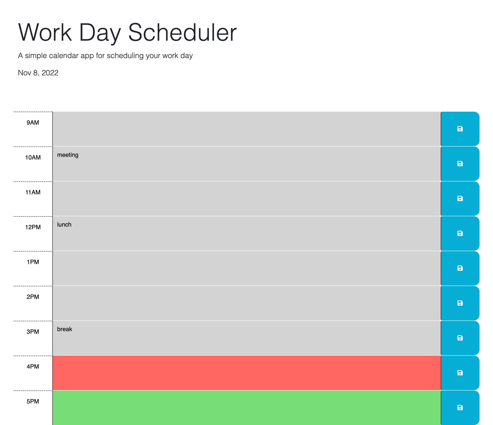

# work-day-scheduler

A Work Day Scheduler

## Description

I created this daily planner to help anyone that is looking to organize their busy lifestyle. This planner will help you to manage your time by allowing the user to schedule important events for each hour of the day and dynamically changes the color of the hours to let you know exactly where you are at throughout the day. The planner will also store your comments and they will be saved even if the page is refreshed!

---

## Screenshot

---

## Link to Deployed Application

<https://eebbinghaus.github.io/work-day-scheduler/>
